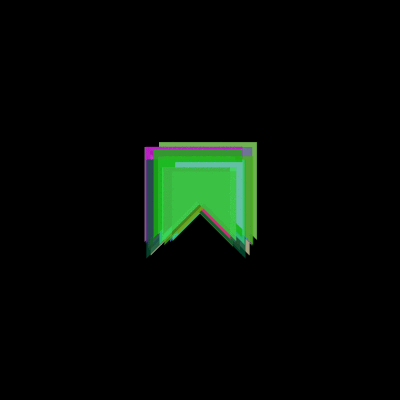

# Orientação a objetos<br> com bandeirinhas



## Um exemplo em 7 passos
*Para executar [instale o Processing com o modo Python](http://villares.github.io/como-instalar-o-processing-modo-python/)*

Apresentamos aqui um exemplo de orientação a objetos utilizado em diversas aulas com pequenas variações. Para poder aproveitar o exemplo os alunos tem em aulas anteriores tiveram contato com programação procedural/imperativa[1] além de vocabulário específico da plataforma Processing:
* Declaração de variáveis e noções de tipagem;
* Métodos de desenho `rect`, `line`, `ellipse`, `beginShape`, `vertex` e `endShape`;
* Controle de atributos gráficos `fill`, `stroke`, `noStroke`, `noFill`, `background`;
* Controle de fluxo de execução e laços `if`, `else`, `for`;
* Declaração de funções com e sem parâmetros;
* Controle do sistema de coordenadas `pushMatrix`, `translate`, `rotate`, `scale`, `popMatrix`.

### 0. Definindo funções e deslocando o sistema de cordenadas

Começamos com a definição de uma função `bandeirinha()` que recebe como parâmetros as coordenadas onde deve ser desenhada (e pode receber um parâmetro de tamanho opcional) produzindo um polígono fechado em forma de bandeirinha.  

No lugar de somar as cordenadas de localização recebidas como parâmetros aos vértices do polígonos usamos a estratégia de translação do sistema de cordenadas, moveremos a origem e em seguida desenharemos o polígono. Antes da translação é interessante preservar o sistema orginal de coordenadas com o comando `pushMatrix()`. Isso pode ser feito simplesmente invocando `pushMatrix()` antes da translação e `popMatrix()` ao final do desenho (restaurando o sistema de coordenadas original), ou com a linha  `with pushMatrix():` seguida de um bloco indentado de código que executa a translação e o desenho (ao final do bloco, encerra-se o contexto e a origem é restaurada), e é o que faremos.

```python
def setup():
    """ Código chamado uma vez no início da execução pelo Processing """
    size(100, 100)  # define as dimensões do 'canvas' do Processing
    bandeirinha(50, 50)  # chama a função bandeirinha
 
def bandeirinha(px, py, tamanho=50):
    """ Desenha polígono em torno das coordenadas passadas, com tamanho padrão 50 """
    metade = tamanho / 2
    with pushMatrix():   # preseservando o sistema de coordenadas anterior,
        translate(px, py)  # translada o sistema de coordenadas
        beginShape()  # inicia polígono
        vertex(-metade, -metade)
        vertex(-metade, metade)
        vertex(0, 0)
        vertex(metade, metade)
        vertex(metade, -metade)
        endShape(CLOSE)  # encerra polígono, fechando no primeiro vértice
```
A definição da função `setup()` não é obrigatória no Modo Python, mas é a parte inicial da estrutura `setup()`/`draw()` usada na maior parte dos programas que trabalham com interação ou movimento, e é invocada uma única vez no início da execução. Note que neste momento já estará definida a função `bandeirinha()`. 

###  1. Redesenhando formas e atualizando variáveis no loop principal

Para se obter o efeito de movimento, animação da bandeirinha, criamos um par de variáveis globais `x` e `y`, inicializadas no bloco `setup()` com as coordenadas do meio da àrea de desenho. Note-se que o escopo global dessas variáveis precisa ser indicado com a palavra chave `global`, quando pretendemos alterá-las.

O novo bloco `draw()` cujo nome faz parte da infraestrutura de processing para permitir animações, terá automaticamente a execução repetida continuamente, é o que chamamos de laço principal do programa. Neste laço vamos inicialmente limpar a tela com `background()`invocar a função de desenho `bandeirinha()` na posição indicada pelas variáveis `x` e `y`, incrementar as variáves de posição e por fim checar se estas estão além de um limite limite e precisam ser alteradas (redefinindo a posição para um novo ciclo de incrementos).

```python
def setup():
    """ Código de configuração, executado no início pelo Processing """
    global x, y
    size(100, 100)  # área de desenho
    x, y = width / 2, height / 2   # coordenadas do meio da área de desenho

def draw():
    """ Laço principal de repetição do Processing """
    global x, y
    background(0)  # limpeza do frame, fundo preto
    bandeirinha(x, y)  # desenha o polígono
    x += 1  # incrementa o x
    y += 1  # incrementa o y
    if x > width + 25:
        x = -25
    if y > height + 25:
        y = -25
        
# [...continua com a def bandeirinha mostrada anteriormente...] 
```
### 2. Primeira aproximação da classe Bandeirinha

### 3. Instanciando mais alguns objetos

### 4. Ampliando a classe, mudando o comportamento e adicionando outras propriedades.

### 5. Uma lista de objetos

### 6. Acrescentando e removendo objetos; Mudança da cor com o mouse próximo.

[1] http://cs.lmu.edu/~ray/notes/paradigms/
